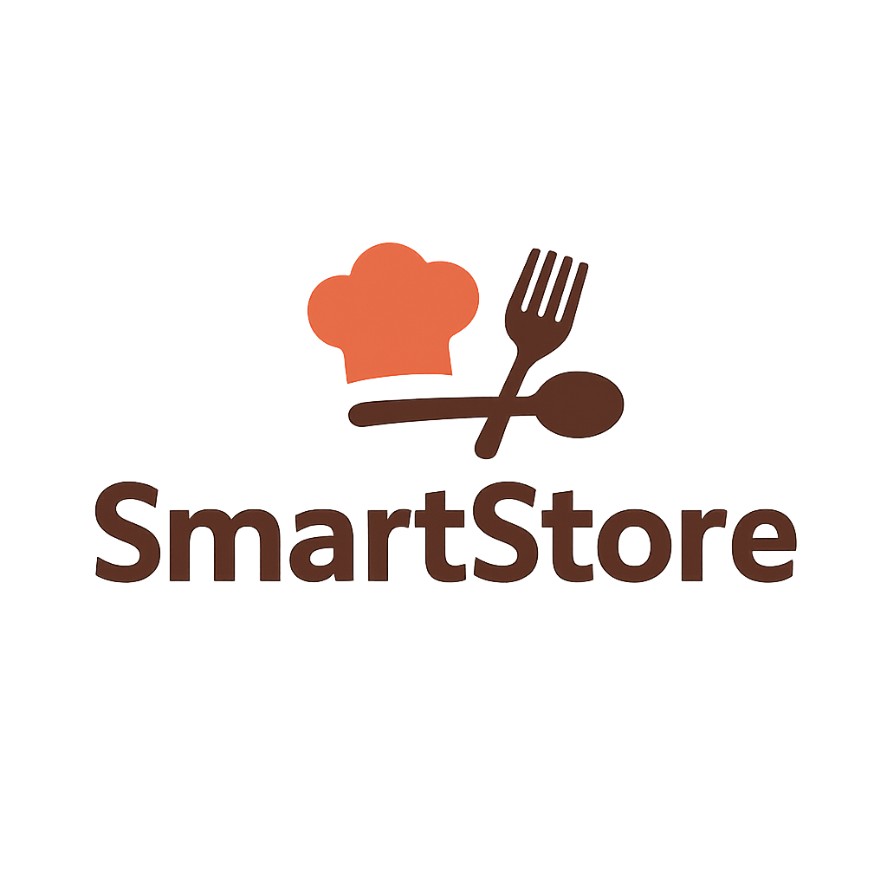

Proyecto de gestor de tienda para el proyecto de ITSHopelchen

## Descripción
Un programa para el proyecto de interfaces de tienda como proyecto final de la materia de POO hecho en python,que se salio un poco de las manos.

## Funcionalidades
- Interfaz de usuario con Flet.
- Base de datos con PostgreSQL.
- Servidor con FastAPI.
- Logeo y registro de productos.
- Pantalla de inicio.
- Pantalla de categorias.
- Subida de productos con información basica (Imagen, titulo, precio, descripcion, stock, video opcional y registro del usuario que lo subio).
- Barra de busqueda funcional, con busqueda de palabras clave, desde el titulo hasta la descripcion.
- Carrito de compras.
- Pantalla de perfil, con los productos que el usuario haya subido (con la opcion de ver las compras sin terminar).
- Visualización basica de la información de los productos.
## Instalación
Antes de iniciar con cualquier paso del programa se deben descargar los paquetes usados en el programa, estos paquetes se pueden descargar facilmente desde la interfaz de comandos de python o desde la terminal de windows. Para descargar los paquetes se debe ejecutar el siguiente comando en la terminal de windows: pip install (Aqui ira el nombre del paquete a descargar).
La lista de los paquetes es la siguiente:
-Flet. (Lo principal del programa para montar la interfaz)
-SqlAlchemy. (Herramienta para interactuar con bases de datos usando un enfoque         orientado a objetos)
-Pycopg2. (Adaptador para conectar Python con bases de datos PostgreSQL)
-FastApi. (Es un framework web de alto rendimiento para crear APIs (Interfaces de Programación de Aplicaciones) basadas en HTTP utilizando Python 3.8+)
-Pydantic. (Es una libreria para validar los modelos de la base de datos)
-Uvicorn. (Es un servidor web para Python basado en uvloop y hyper, en este caso se usa para montar el servidor FastAPI)

### 1.- Linea para instalar los paquetes en la terminal
`pip install flet sqlalchemy psycopg2 fastapi pydantic uvicorn requests reportlab`
### 2.- Iniciar la base de datos
Despues sera necesario que instales [PostgreSQL](https://www.postgresql.org/download/windows/) y crear una base de datos llamada "SmartStore" con el siguiente comando en la terminal de windows: psql -U postgres -c "CREATE DATABASE SmartStore;", para iniciar la base de datos de postgresql se debe usar el siguiente comando en la terminal de windows: pg_ctl -D "C:\Program Files\PostgreSQL\15\data" start (Aunque es recomenda)
Asegurate de que la instalación sea en la carpeta correcta de tu pc o la que esta por defecto, ya que es necesario para que el servidor funcione correctamente.
## Instrucciones de uso
Primero y lo mas recomendable seria descargar visual studio e installar todos los modulos de python para poder hacer debug al programa.
Para correr el servidor se debe usar el siguiente comando en la terminal de windows: uvicorn server:app --reload.
Luego en visual estudio correr el archivo main.py, para correr el archivo main.py se debe usar el siguiente comando en la terminal de windows: python main.py y ya se podria usar la interfaz con las funciones disponibles.